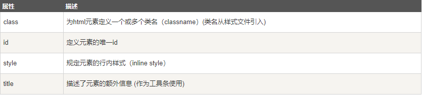

#### **HTML属性**

* HTML元素可以设置属性
* 属性可以在元素中添加附加信息
* 属性一般描述于开始标签
* 属性总是以名称/值对的形式出现，比如：name="value"

>比如：
HTML 链接由 `<a>` 标签定义。链接的地址在 href 属性中指定：
`<a href="http://www.mygaryfly.com">这是一个链接</a>`

**Tips**
1. 属性值应该始终被包括在引号内。
2. 双引号是最常用的，不过使用单引号也没有问题。
3. 在某些个别的情况下，比如属性值本身就含有双引号，那么您必须使用单引号，例如：name='John "ShotGun" Nelson'
4. 属性和属性值对大小写不敏感。不过，万维网联盟在其HTML4推荐标准中推荐小写的属性/属性值。

>下面列出了适用于大多数 HTML 元素的属性

<a href="https://www.runoob.com/tags/ref-standardattributes.html" color="red">HTML标准属性参考手册</a>