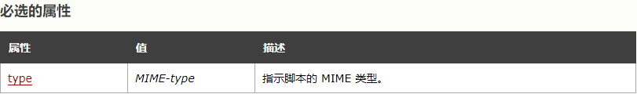
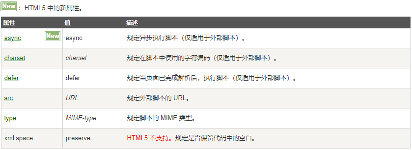

#### SCRIPT标签

#### 一，SCRIPT标签基础

##### 1.1 简介
* `<script>` 标签用于定义客户端脚本，比如 JavaScript
* `<script>` 元素既可包含脚本语句，也可以通过 "src" 属性指向外部脚本文件
* JavaScript 通常用于图像操作、表单验证以及动态内容更改。

##### 1.2 属性

> * `<script>` 标签支持 HTML 的全局属性

