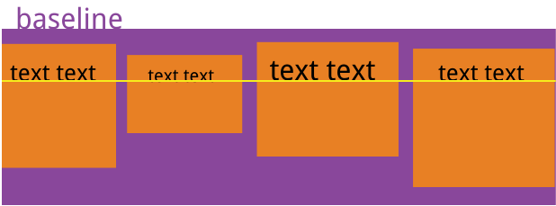

#### **CSS3 弹性盒子(Flex Box)**

[**flex快速通道**](https://www.zhangxinxu.com/wordpress/2018/10/display-flex-css3-css/) —— 来自张鑫旭

#### **一，定义**
弹性盒子是 CSS3 的一种新的布局模式。

CSS3 弹性盒（ Flexible Box 或 flexbox），是一种当页面需要适应不同的屏幕大小以及设备类型时确保元素拥有恰当的行为的布局方式。

引入弹性盒布局模型的目的是提供一种更加有效的方式来对一个容器中的子元素进行排列、对齐和分配空白空间。

* 弹性盒子由弹性容器(Flex container)和弹性子元素(Flex item)组成。

* 弹性容器通过设置 display 属性的值为 flex 或 inline-flex将其定义为弹性容器。

* 弹性容器内包含了一个或多个弹性子元素。

* 任何一个容器都可以指定为Flex布局。
```css
.box{
  display: flex;
}
```
* 行内元素也可以使用Flex布局。
```css
.box{
  display: inline-flex;
}
```
**注意**： 设为Flex布局以后，子元素的float、clear和vertical-align属性将失效。

<br>

#### **二，flex的属性**

##### **2.1 - 作用在flex容器上的属性**

##### **2.1-1 - flex-direction**
语法：`flex-direction: row | row-reverse | column | column-reverse`

flex-direction的值有:

* row：横向从左到右排列（左对齐），默认的排列方式。
* row-reverse：反转横向排列（右对齐，从后往前排，最后一项排在最前面。
* column：纵向排列。
* column-reverse：反转纵向排列，从后往前排，最后一项排在最上面。

##### **2.1-2 - justify-content**
语法：`justify-content: flex-start | flex-end | center | space-between | space-around
`

* flex-start：
弹性项目向行头紧挨着填充。这个是默认值。第一个弹性项的main-start外边距边线被放置在该行的main-start边线，而后续弹性项依次平齐摆放。

* flex-end：
弹性项目向行尾紧挨着填充。第一个弹性项的main-end外边距边线被放置在该行的main-end边线，而后续弹性项依次平齐摆放。

* center：
弹性项目居中紧挨着填充。（如果剩余的自由空间是负的，则弹性项目将在两个方向上同时溢出）。

* space-between：
弹性项目平均分布在该行上。如果剩余空间为负或者只有一个弹性项，则该值等同于flex-start。否则，第1个弹性项的外边距和行的main-start边线对齐，而最后1个弹性项的外边距和行的main-end边线对齐，然后剩余的弹性项分布在该行上，相邻项目的间隔相等。

* space-around：
弹性项目平均分布在该行上，两边留有一半的间隔空间。如果剩余空间为负或者只有一个弹性项，则该值等同于center。否则，弹性项目沿该行分布，且彼此间隔相等（比如是20px），同时首尾两边和弹性容器之间留有一半的间隔（1/2*20px=10px）。


##### **2.1-3 - flex-wrap**

默认情况下，项目都排在一条线（又称”轴线”）上。flex-wrap属性定义，如果一条轴线排不下，如何换行。


语法：`flex-wrap: nowrap | wrap | wrap-reverse;`

它可能取三个值。

* nowrap（默认）：不换行。
* wrap：换行，第一行在上方。

* wrap-reverse：换行，第一行在下方。


##### **2.1-4 - flex-flow**
flex-flow属性是flex-direction属性和flex-wrap属性的简写形式，默认值为row nowrap。

语法：`  flex-flow: <flex-direction> <flex-wrap>;`

##### **2.1-5 - justify-content**
justify-content属性定义了子元素所有项目作为一个整体在主轴上的对齐方式。

语法：`  justify-content: flex-start | flex-end | center | space-between | space-around;
`

它可能取5个值，具体对齐方式与轴的方向有关。下面假设主轴为从左到右。

* flex-start（默认值）：左对齐
* flex-end：右对齐
* center： 居中
* space-between：两端对齐，项目之间的间隔都相等。
* space-around：每个项目两侧的间隔相等。所以，项目之间的间隔比项目与边框的间隔大一倍。

##### **2.1-6 - align-items**
align-items属性定义项目在交叉轴上如何对齐。

语法： `  align-items: flex-start | flex-end | center | baseline | stretch;
`
它可能取5个值。具体的对齐方式与交叉轴的方向有关，下面假设交叉轴从上到下。

* flex-start：交叉轴的起点对齐。
* flex-end：交叉轴的终点对齐。
* center：交叉轴的中点对齐。
* baseline: 项目的第一行文字的基线对齐。
* stretch（默认值）：如果项目未设置高度或设为auto，将占满整个容器的高度。




 ##### **2.1-6 - align-content**

align-content属性定义了多根轴线的对齐方式。如果项目只有一根轴线，该属性不起作用。所属6个值的使用方式和align-items类似。

语法：`  align-content: flex-start | flex-end | center | space-between | space-around | stretch;
`
<br>

##### **2.2 - 作用在flex项目上的属性**
以下6个属性设置在项目上。

* order
* flex-grow
* flex-shrink
* flex-basis
* flex
* align-self

 ##### **2.2-1 - order**

 order属性定义项目的排列顺序。数值越小，排列越靠前，默认为0。

语法：
```css
.item {
  order: <integer>;
}
```


 ##### **2.2-2 - flex-grow**

flex-grow属性定义项目的放大比例，默认为0，即如果存在剩余空间，也不放大。

语法：
```css
.item {
  flex-grow: <number>; /* default 0 */
}
```
* 如果所有项目的flex-grow属性都为1，则它们将等分剩余空间（如果有的话）。如果一个项目的flex-grow属性为2，其他项目都为1，则前者占据的剩余空间将比其他项多一倍。

 ##### **2.2-3 - flex-shrink**
 flex-shrink属性定义了项目的缩小比例，默认为1，即如果空间不足，该项目将缩小。

语法：
```css
.item {
  flex-shrink: <number>; /* default 1 */
}
```
* 默认值是1，也就是默认所有的flex子项都会收缩。如果设置为0，则表示不收缩，保持原始的fit-content宽度。

* 如果所有项目的flex-shrink属性都为1，当空间不足时，都将等比例缩小。如果一个项目的flex-shrink属性为0，其他项目都为1，则空间不足时，前者不缩小。

* 负值对该属性无效。

 

 ##### **2.2-4 - flex-basis**

flex-basis属性定义了在分配多余空间之前，项目占据的主轴空间（main size）。浏览器根据这个属性，计算主轴是否有多余空间。它的默认值为auto，即项目的本来大小。

语法：
```css
.item {
  flex-basis: <length> | auto; /* default auto */
}
```
* 该属性有两个快捷值：auto (1 1 auto) 和 none (0 0 auto)。
* 建议优先使用这个属性，而不是单独写三个分离的属性，因为浏览器会推算相关值。

 ##### **2.2-4 - align-self**
align-self属性允许单个项目有与其他项目不一样的对齐方式，可覆盖align-items属性。默认值为auto，表示继承父元素的align-items属性，如果没有父元素，则等同于stretch。
>语法：
```css
.item {
  align-self: auto | flex-start | flex-end | center | baseline | stretch;
}
```

