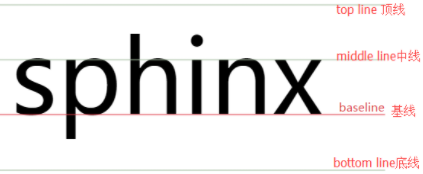

## Alignment - 对齐
***

### **一， text-align**
定义和用法:
text-align 属性规定元素中的文本的水平对齐方式。
该属性通过指定行框与哪个点对齐，从而设置块级元素内文本的水平对齐方式。通过允许用户代理调整行内容中字母和字之间的间隔，可以支持值 justify；不同用户代理可能会得到不同的结果。

* 如果 direction 属性是 ltr，则默认值是 left；如果 direction 是 rtl，则为 right。
* 继承性: YES
* JavaScript 语法：	`object.style.textAlign="right"`

<table>
    <tr style="background: black;">
        <th>值</th>
        <th>描述</th>      
    </tr>
    <tr>
        <td style="text-align:center;">left</td>
        <td>把文本排列到左边。默认值：由浏览器决定。</td>        
    </tr>
    <tr>
        <td style="text-align:center;">right</td>
        <td>把文本排列到右边</td>        
    </tr>
    <tr>
        <td style="text-align:center;">center</td>
        <td>把文本排列到中间。</td>        
    </tr>
    <tr>
        <td style="text-align:center;">justify</td>
        <td>实现两端对齐文本效果。</td>        
    </tr>
    <tr>
        <td style="text-align:center;">inherit</td>
        <td>规定应该从父元素继承 text-align 属性的值</td>        
    </tr>
    <tr>
        <td style="text-align:center;">start</td>
        <td>把文本排列到流方向的起始处</td>        
    </tr>
    <tr>
        <td style="text-align:center;">end</td>
        <td>把文本排列到流方向的终点处</td>        
    </tr>
</table>

<br>
关于justify: 最后一个水平对齐属性是 justify，它会带来自己的一些问题。

值 justify 可以使文本的两端都对齐。在两端对齐文本中，文本行的左右两端都放在父元素的内边界上。然后，调整单词和字母间的间隔，使各行的长度恰好相等。您也许已经注意到了，两端对齐文本在打印领域很常见。不过在 CSS 中，还需要多做些考虑。

要由用户代理（而不是 CSS）来确定两端对齐文本如何拉伸，以填满父元素左右边界之间的空间。例如，有些浏览器可能只在单词之间增加额外的空间，而另外一些浏览器可能会平均分布字母间的额外空间（不过 CSS 规范特别指出，如果 letter-spacing 属性指定为一个长度值，“用户代理不能进一步增加或减少字符间的空间”）。还有一些用户代理可能会减少某些行的空间，使文本挤得更紧密。所有这些做法都会影响元素的外观，甚至改变其高度，这取决于用户代理的对齐选择影响了多少文本行。

CSS 也没有指定应当如何处理连字符（注1）。大多数两端对齐文本都使用连字符将长单词分开放在两行上，从而缩小单词之间的间隔，改善文本行的外观。不过，由于 CSS 没有定义连字符行为，用户代理不太可能自动加连字符。因此，在 CSS 中，两端对齐文本看上去没有打印出来好看，特别是元素可能太窄，以至于每行只能放下几个单词。当然，使用窄设计元素是可以的，不过要当心相应的缺点。

<br>

***

### **二，vertical-align** [[直通车-转载来自张鑫旭-鑫空间-鑫生活https://www.zhangxinxu.com]](https://www.zhangxinxu.com/wordpress/2010/05/%e6%88%91%e5%af%b9css-vertical-align%e7%9a%84%e4%b8%80%e4%ba%9b%e7%90%86%e8%a7%a3%e4%b8%8e%e8%ae%a4%e8%af%86%ef%bc%88%e4%b8%80%ef%bc%89/)
定义和用法：
vertical-align 属性设置元素的垂直对齐方式。

该属性定义 **行内元素** 的基线相对于该元素所在行的基线的垂直对齐。允许指定负长度值和百分比值。这会使元素降低而不是升高。在表单元格中，这个属性会设置单元格框中的单元格内容的对齐方式。
* 默认值：baseline
* 继承性：NO
* JavaScript 语法：	`object.style.verticalAlign="bottom"`

<table>
    <tr style="background: black;">
        <th style="text-align:center;">值</th>
        <th>描述</th>        
    </tr>
    <tr>
        <td style="text-align:center;">关键字值: baseline</td>
        <td>默认。元素放置在父元素的基线上.</td>        
    </tr>
    <tr>
        <td style="text-align:center;">关键字值: sub</td>
        <td>降低元素的基线到父元素合适的下标位置。</td>        
    </tr>
    <tr>
        <td style="text-align:center;">关键字值: super</td>
        <td>升高元素的基线到父元素合适的上标位置。</td>        
    </tr>
    <tr>
        <td style="text-align:center;">关键字值: top</td>
        <td>把元素的顶端与行中最高元素的顶端对齐。</td>        
    </tr>
    <tr>
        <td style="text-align:center;">关键字值: text-top</td>
        <td>把元素的顶端与父元素字体的顶端对齐。</td>        
    </tr>
    <tr>
        <td style="text-align:center;">关键字值: middle</td>
        <td>元素的中垂点与父元素的基线加1/2父元素中字母x的高度对齐。</td>        
    </tr>
    <tr>
        <td style="text-align:center;">关键字值: bottom</td>
        <td>把对齐的子元素的底端与line box底端对齐。</td>        
    </tr>
    <tr>
        <td style="text-align:center;">关键字值: text-bottom	</td>
        <td>把元素的底端与父元素内容区域的底端对齐。</td>        
    </tr>
    <tr>
        <td style="text-align:center;">长度值 | length: em / px</td>
        <td>升高（正值）或降低（负值）子元素盒子。值为升高/降低的距离，如果为0，和vertical-align:baseline一样。</td>        
    </tr>
    <tr>
        <td style="text-align:center;">百分比值 | %</td>
        <td>使用 "line-height" 属性的百分比值来排列此元素。允许使用负值。</td>        
    </tr>
    <tr>
        <td style="text-align:center;">全局值： inherit</td>
        <td>采用父元素相关属性的相同的指定值。</td>        
    </tr>
    <tr>
        <td style="text-align:center;">全局值： initial</td>
        <td>设置属性的初始值——浏览器的默认定义值.</td>        
    </tr>
    <tr>
        <td style="text-align:center;">全局值： unset</td>
        <td> 关键字 initial 和 inherit的组合 | 如果有继承父级样式，则将该属性重新设置为继承的值，如果没有继承父级样式，则将该属性重新设置为初始值。</td>        
    </tr>
</table>
<br>



* 关于长度值/数值：我们理解为，元素相对于基线向上或者向下偏移(offset)。
* 关于百分数值: 元素相对于基线向上或者向下偏移,但它的取值是相对于`line-height`计算的。
    * IE6/IE7浏览器下的`vertical-align`的百分比值不支持小数`line-height`
* 

#### **[2-1] vertical-align 和 line-height**

有个属性值暴露了`vertical-align`和`line-height`之间的关系,就是“百分比值”

`vertical-align`的百分比值不是相对于字体大小或者其他什么属性计算的，而是相对于`line-height`计算的。举个简单的例子，如下CSS代码：
```css
{
  line-height: 40px;
  vertical-align: -10%;
}
```
实际上，等同于：
```css
{
  line-height: 40px;
  vertical-align: -4px; /* = 40px * -10% */
}
```

#### **[2-2] 为什么我的vertical-align属性不起作用？**
> 知道了`vertical-align`是垂直对齐的意思，不少经验尚浅的同行会试着使用这个属性实现一些垂直方向上的对齐效果，会发现有时候可以，有时候又不起作用，不知道为什么？我们知道display也有很多属性值，其中以inline/inline-block/block三个最常见，这代表了页面上三种不同水平的元素。`vertical-align`可以称之为“`inline-block`依赖型元素”，也就是说，只有一个元素属于`inline`或是`inline-block`，其身上的vertical-align属性才会起作用。
>> 所谓`inline-block`水平的元素，就是既可以与inline水平元素混排，又能设置高宽属性的元素。哪些元素呢，例如图片，按钮，单复选框，单行/多行文本框等HTML控件，只有这些元素默认情况下会对vertical-align属性起作用。
* 虽然`vertical-align`属性只会在`inline-block`水平的元素上起作用，但是其影响到的元素涉及到inline属性的元素，这里千万记住，inline水平元素受vertical-align属性而位置改变等不是因为其对vertical-align属性敏感或起作用，而是受制于整个line box的变化而不得不变化的，这个后面会较为深入的分析。

讲到inline-block就不得不提`vertical-align`的`baseline`属性

**`baseline`的确定规则：**
* inline-table元素：table第一行的baseline
* 父元素 line box: 最后一个inline box的baseline
* 纯文本的内联元素：字符x的下边缘
* 替换元素： 替换元素的下边缘
* inline-block: 
    * 内部没有内联元素，或者overflow不为visible，则baseline为该元素的margin底部边缘
    * 内部有内联元素,baseline是最后一行内联元素的基线


#### **[2-3] vertical-align：middle**
`vertical-align：middle;`特性:
* 布局表现：把子元素放在父元素的中部
* 会改变元素基线
* 不是父元素的绝对中线

【注意】
> 内联元素：元素的垂直中心点对齐行框盒子基线往上1/2 x-height 处，即字符x的中心-交叉位置点

> **需要特别注意的是**，区别于大写X，文字content area内容区的绝对居中位子是大写X的中间，因此小x中心点（与它对齐的其他元素），会略低于绝对中线！

> tabel-cell: 单元格盒子相对于外面的表格行居中对齐